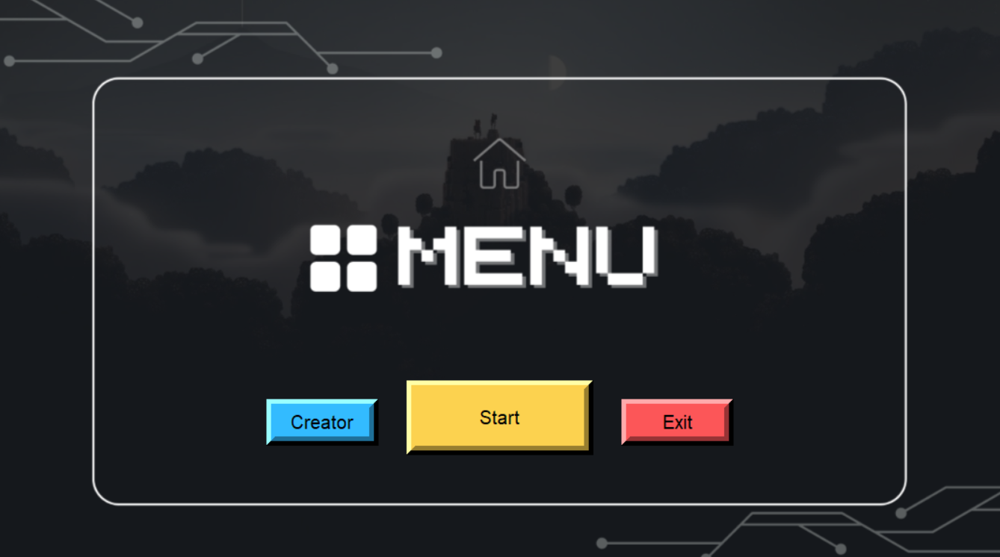
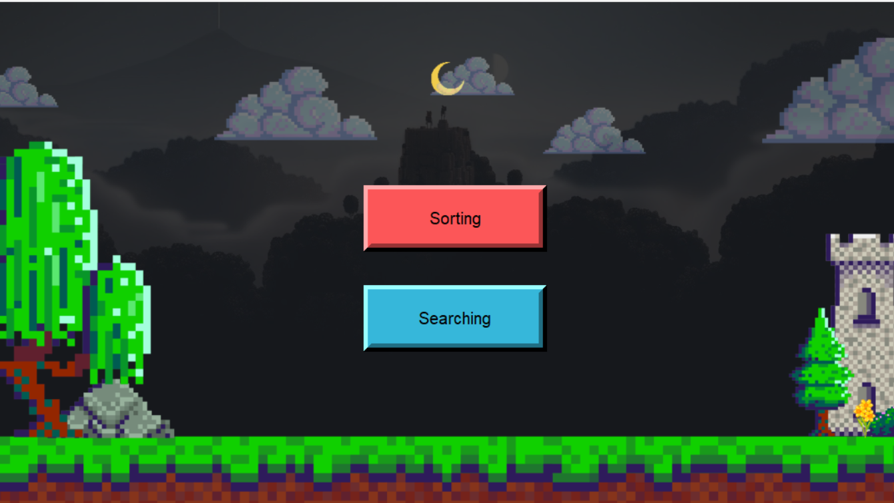
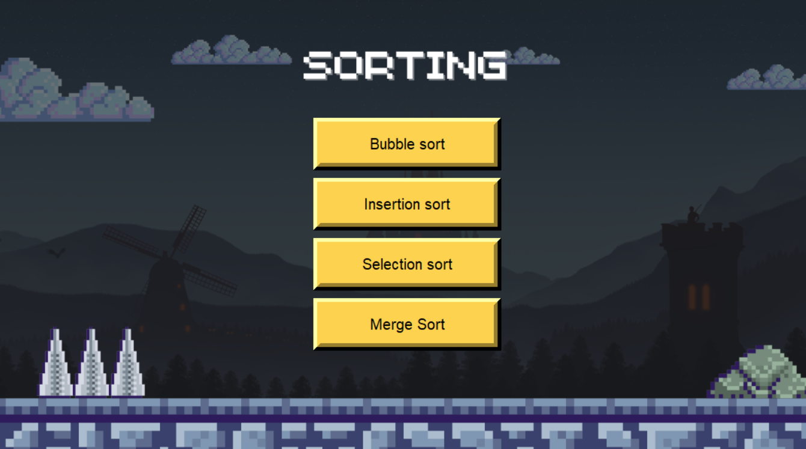
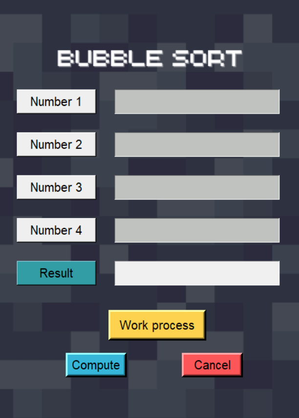
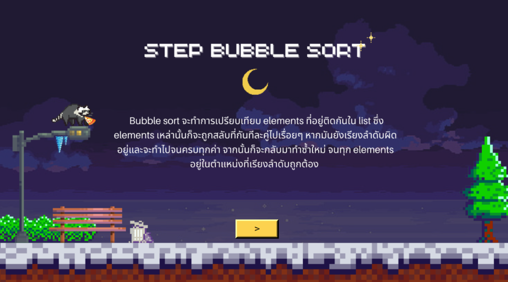
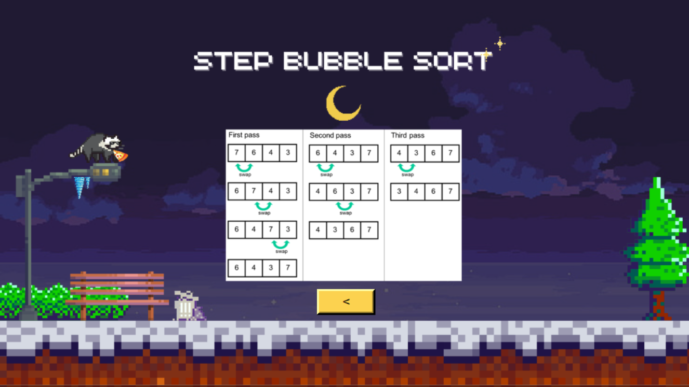

# Mini-Project-GUI
ผมได้ทำ Sort เเละ Search ใน TKinter โดยใช้ Python สร้างขึ้นมาอาจาร์ยต้องการให้ผมเเละเพื่อนๆสร้างมันขึ้นมาเเละนี้คือผลที่ได้ออกมา

## หน้า MeNu โดยจะมีปุ่ม Start ในการเข้าใช้งานเเละปุ่ม Exit ในการออกเเละปุ่ม Creator ว่าในงานนี้มีสมาชิกกี่ท่านในการทำ

## หน้าในการเลือก Sort หรือ Search ในการใช้งาน

## หน้า Sort เลือกในการใช้งานว่าต้องการใช้เเบบไหนในการ Sort

## หน้าในการทำ Bubble Sort โดยจะมีให้ใส่เลขทั้งหมด 4 ช่องเเละมีปุ่ม Work process ในการอธิบายการทำงานของ Bubble Sort ,ปุ่ม Compute ในการทำงานเเละปุ่ม Cancel ในการเคลียข้อมูลที่ใส่ลงไป

## หน้าอธิบายหลักการทำงานของ Bubble Sort

## หน้ารูปอธิบายหลักการทำงานของ Bubble Sort

## หน้าในการทำ Bubble Sort เสร็จสมบูรณ์

